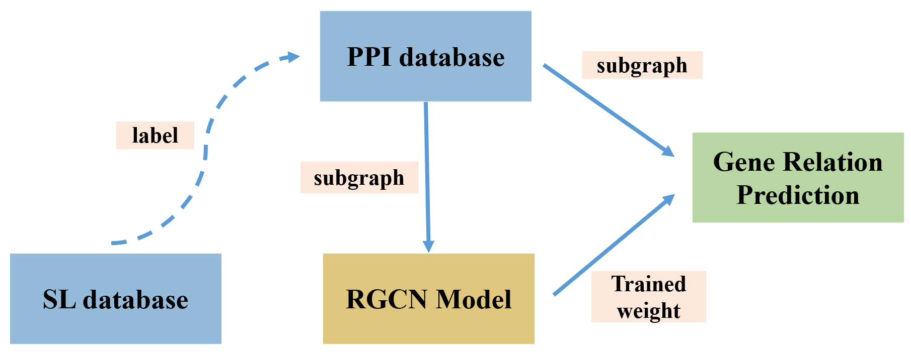

# 基于子图提取的基因关系预测

## 介绍
基于RGCN(图卷积神经网络)的基因关系预测任务：为了解决模型归纳推理能力弱的问题，通过随机游走方法在PPI数据集中提取子图并与SL标签对应以重构数据集。最终的AUC相比RGCN方法提升了约15个百分点。

## 模型

  

## 思路

先前并未直接使用PPI蛋白质图进行训练预测：整个PPI图放进去太大了

我们的思路：使用子图来利用PPI的丰富信息！
